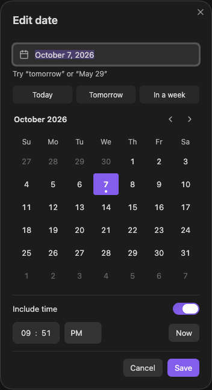

# Notion Dates

Notion-style date pills for Obsidian. Type natural language date mentions like `@today`, `@next wednesday`, or `@may 29`, and the plugin stores them as editable markdown tags while rendering them as compact date pills.



## Features

- Inline date pills in Live Preview and Reading View.
- Notion-style relative labels:
  - `Today`
  - `Tomorrow`
  - `Yesterday`
  - weekday names for dates in the current week
  - `Next Monday` / `Last Friday` for adjacent weeks
  - absolute dates beyond that range
- Smart date insertion from `@` autocomplete.
- Minute offsets from `@now`, such as `@now-5` or `@now+10`.
- Click a date pill to edit it in a compact, theme-aware calendar with keyboard navigation.
- Today, Tomorrow, and In a week shortcuts.
- Optional time support.
- Configurable display format and markdown storage format.
- Automatic rerender when the local date changes, including after midnight or when Obsidian wakes from sleep.

## Usage

Type `@` in the editor to open the date suggestion menu. Choose a suggested date, or keep typing a natural language date.

Examples:

```md
@today
@tomorrow
@now
@now-5
@now15
@now+10
@next wednesday
@last friday
@may 29
@march 17 2pm
@in 3 days
@2026-05-29
@05/29/2026
```

Add a whole number of minutes to `@now`: `@now-5` means five minutes ago,
`@now15` means fifteen minutes from now, and `@now+10` means ten minutes from now.
Select the suggestion or press Enter to insert a date and time. The resulting
timestamp stays fixed after insertion and uses your markdown storage format.
Offsets use elapsed minutes from the current local time, including across midnight
and daylight-saving transitions.

Inserted dates are stored as plugin date tags:

```md
@[2026-05-29]
@[2026-05-29 14:00]
```

Those tags render as pills, such as `@Today`, `@Next Wednesday`, or `@May 29, 2026`, depending on your settings and the current date.

### Editing a date or time

Click a pill in Live Preview or Reading View to open the picker. Select a day,
type a date such as `tomorrow` or `May 29`, or use the **Today**, **Tomorrow**, or
**In a week** shortcut. Switch on **Include time** to enter an hour and minute;
**Now** sets the time fields to the current local time. The picker follows your
12-hour/24-hour and week-start settings.

Choose **Save** to update the note, or **Cancel** or Escape to dismiss the picker.
Invalid dates and times show an error and disable Save. Existing tags and your
chosen markdown storage format are preserved when editing.

Keyboard controls in the calendar:

| Key | Action |
| --- | --- |
| Arrow keys | Move by one day or one week |
| Home / End | Move to the first or last day of the week |
| Page Up / Page Down | Move to the previous or next month |
| Shift + Page Up / Page Down | Move to the previous or next year |
| Enter / Space | Select the focused day |

Use Tab to move between controls. In the hour and minute fields, Arrow Up and
Arrow Down adjust the selected field. Enter in a text field saves a valid date
and time.

## Settings

Open Obsidian Settings, then go to **Community plugins > Notion Dates**.

### Date Label Format

Controls how pills are displayed:

- Notion-style relative
- Short date
- Month day, year
- Weekday, month day, year
- Numeric date
- ISO date

### Time Format

Controls times shown in pills:

- 12-hour
- 24-hour

### Markdown Date Format

Controls what is written inside `@[...]` tags:

- `YYYY-MM-DD`
- `YYYY/MM/DD`
- `MM/DD/YYYY`
- `Month D, YYYY`
- Custom

The default is `YYYY-MM-DD` because it is portable and unambiguous.

### Custom Markdown Format

When Markdown Date Format is set to **Custom**, enter a format using these tokens:

- `YYYY`
- `YY`
- `MM`
- `M`
- `DD`
- `D`

Examples:

```text
YYYY-MM-DD
YYYY-DD-MM
MM/DD/YYYY
D-M-YY
```

Custom formats must include a year token, a month token, and a day token. If the custom format is invalid, the plugin falls back to `YYYY-MM-DD`.

### Week Starts On

Controls how relative labels such as `Tuesday`, `Next Monday`, and `Last Friday` are calculated.

## Installation

For manual installation or updating:

1. Download `main.js`, `manifest.json`, and `styles.css` from the same release on
   the [GitHub releases page](https://github.com/7slash/Obsidian-Notion-Dates/releases).
2. Create the plugin folder if needed, then copy the three files into it:

```text
<your vault>/.obsidian/plugins/notion-dates/
```

3. Open **Settings > Community plugins** and enable **Notion Dates**. If it is
   already enabled, turn it off and back on to load the updated files.

The **Reload plugins** button refreshes the installed-plugin list. To load a new
build, use the plugin's enable switch to turn it off and back on.

For a local build, use the same three files produced by `npm run build`.

## Development

Install dependencies:

```sh
npm ci
```

Build:

```sh
npm run build
```

Development watch mode:

```sh
npm run dev
```

To auto-copy builds into a vault plugin folder, set:

```sh
OBSIDIAN_VAULT_PLUGIN_PATH="/path/to/vault/.obsidian/plugins/notion-dates" npm run dev
```

Create the destination plugin folder before starting watch mode. After a build,
turn Notion Dates off and back on in Obsidian to load the new code.

### Preparing a release

1. Set the same version in `manifest.json`, `package.json`, and the root package
   entries in `package-lock.json`. Add its minimum Obsidian version to `versions.json`.
2. Run `npm run build`.
3. Commit and push the source, documentation, and version metadata.
4. Create a GitHub release with a tag matching `manifest.json` exactly, such as
   `1.2.0` (without a `v` prefix).
5. Attach **`main.js`, `manifest.json`, and `styles.css` as three separate files**.
   Paste the release notes into the release description.

The source archives generated by GitHub are separate from the plugin assets.
`README.md`, `versions.json`, TypeScript source, and dependency files belong in
the repository; they are not plugin release attachments. See Obsidian's
[release guide](https://docs.obsidian.md/Plugins/Releasing/Submit%20your%20plugin).

## Privacy and Security

This plugin runs locally inside Obsidian. It does not make network requests or send note content to external services.

When editing a pill in Reading View, the plugin updates the source file that rendered the clicked date tag.

## Author

7slash
